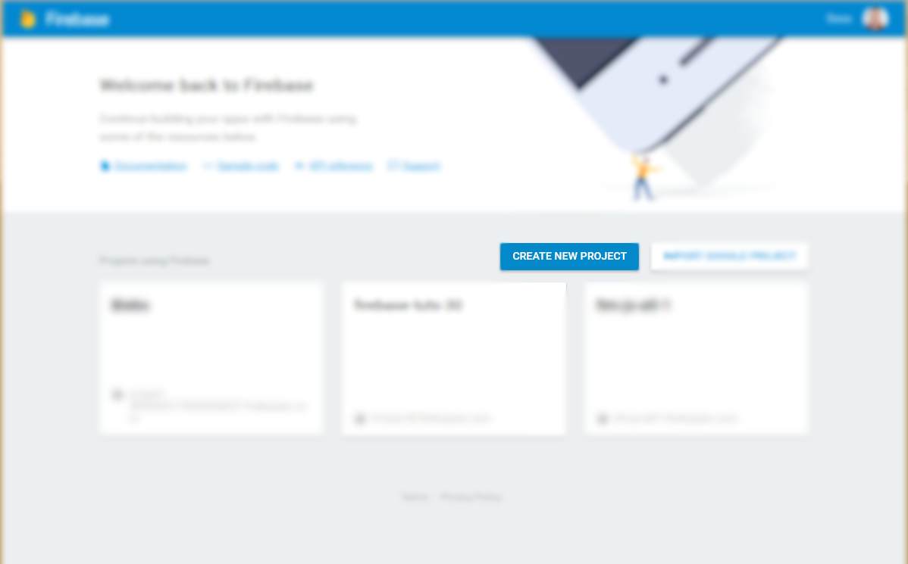
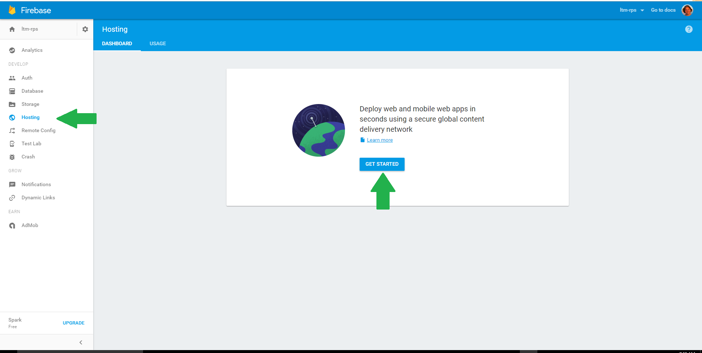
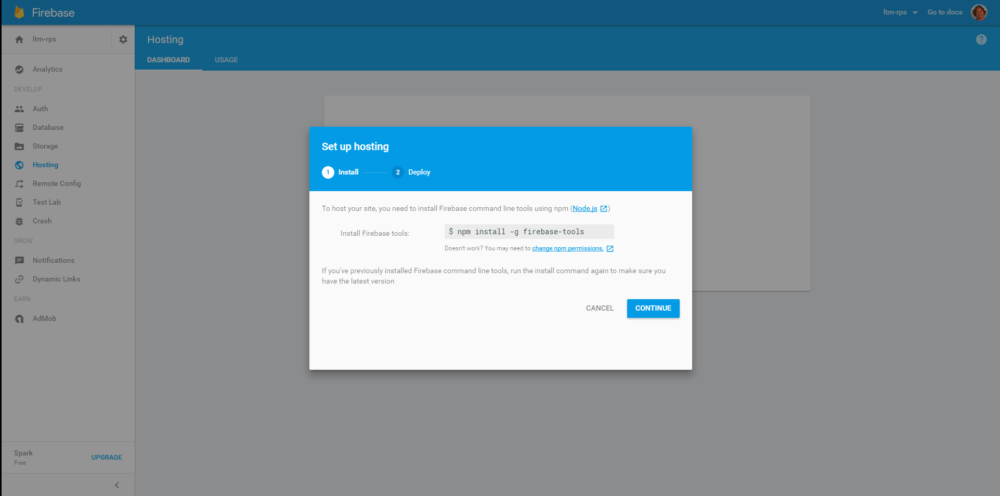
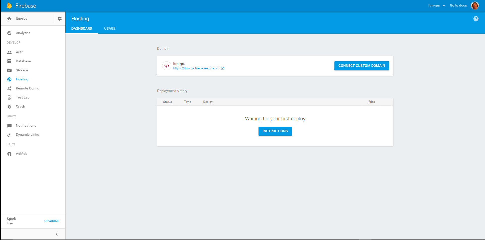

# Intro to CRUD and Firebase (3:00)

| Timing | Type | Topic |
| --- | --- | --- |
| 10 min | [Opening](#opening) | Introduction to CRUD and Firebase |
| 20 min | [Review](#review) | A Little Review...A lotta CRUD |
| 15 min | [Introduction](#introduction1) | Understand CRUD Through Public APIs |
| 10 min | [Introduction](#introduction2) | Firebase Introduction |
| 35 min | [Setup](#setup) | Firebase Setup |
| 5 min | [Introduction](#introduction3)  | Intro to CRUD with Firebase |
| 20 min | [Codealong](#codealong1)  | Create with Firebase |
| 20 min | [Codealong](#codealong2) | Read wih Firebase  |
| 30 min | [Codealong](#codealong3) | Update with Firebase  |
| 10 min | [Codealong](#codealong4) | Delete with Firebase |
| 10 min |  [Conclusion](#conclusion)| Final Questions & Exit Tickets |


### Objectives

_After this lesson, students will be able to:_

- Explain what CRUD is.
- Explain the HTTP methods associated with CRUD.
- Implement Firebase in an application.
- Build a full-stack app.

### Preparation

_Before this lesson, students should already be able to:_

- Identify all the HTTP Verbs & their uses.
- Describe APIs & how to make calls and consume API data.

---

<a name = "opening"></a>
## Introduction to CRUD and Firebase (10 min)

In terms of an app's functionality, in general, most app's share the purpose of being able to show, create, update and delete data. For example, with Instagram a user is allowed to create and show data by uploading pictures with captions and share them with all their followers to see. Further, if the user wanted to go back and update the data, say they wanted to change the caption, they could do so by editing the caption or they could even delete all the data by removing the entire post. Similarly, with Tumblr, users can create posts they wish to share which they can edit later or even delete entirely. Being made aware of this pattern in apps can you name two or more apps and how they go about performing this functionality?

This common app functionality dealing with data is known as CRUD (Create, Read, Update and Delete). For today's lesson we will not only become familiar with this concept, but learn how to implement it with the help of a back-end service known as Firebase as we build out our very own CRUD application.

---

<a name = "review"></a>
## A Little Review...A Lotta CRUD (20 min)

Even though we have never explicitly covered the term CRUD in this course, we have covered some of the technical implementations of performing CRUD. Can you think of what we have learned in an earlier lesson that relates to an application's ability to create, read, update and delete data? If it is not apparent as of yet, take a step back to think about what we know is needed in order to "play" with data. If the term API comes to mind you're on the right track. Using our _Advanced APIs_ lesson as an example, when we wanted to get 500px's post data, we had to ping one of 500px's API endpoints to do so. But how exactly did we go about communicating with 500px's endpoint? Herein lies the answer to our original question of what technical feature we have already learned which is related to CRUD, and that is _HTTP_.

When developing an application that deals with data, a developer must be able to communicate with the application program interface (API) using various HTTP methods. To better understand how the different HTTP methods we already know perform CRUD checkout at the following table:

|HTTP Method|CRUD|Further explanation|
|:---|:-----|:-----|
|POST| Create|Most-often utilized to _create_ new resources. On successful creation returns a 201 status code.
|GET| Read|The HTTP GET method is used to _read_ a representation of a resource. Upon success, returns data in the form of XML or JSON with a 200 status code. Upon failure, often returns a 404 or 400.
|PUT| Update|Most often utilized to for _update_ capabilities. Upon successful update, often returns a 200 or 204.
|DELETE| Delete|Used to _delete_ a resources. Upon successful deletion, most often returns a 200 status code.

---

<a name = "introduction1"></a>
## Understand CRUD Through Public APIs (15 min)

Now that you have an understanding of what CRUD is and how HTTP methods help you implement it, spend the next 15 minutes with a partner researching two of the following APIs to see what HTTP methods a developer must use to perform at least one instance of create, read, update and destroy. Further, you must define what exactly is being created, read, updated or deleted. For example, for Facebook what HTTP method on what endpoint must you ping in order to create a post in a feed?

API options:

- Facebook
- Instagram
- Twitter
- YouTube
- Flickr

> **Note:** Certain APIs may not allow for full CRUD functionality. If you're researching one of these APIs be sure to point out its limitations.

---

<a name = "introduction2"></a>
## Firebase, a Back-end Service (10 min)

So far in this course we have covered how to consume data from third-party APIs, but have not yet created our own API. The work that we have been doing is what is known in the tech industry as client-side or _front-end_ development.

> Front end development, also known as client side development is the practice of producing HTML, CSS and JavaScript for a website or web application so that a user can see and interact with them directly.

> -wikipedia

The process of actually creating the API, not consuming it, is what is known as _back-end_ development. You can think of back-end code as all the code living on the server-side, the code that app users never interact with directly. It is the "non-HTML-CSS-JavaScript" code.

Even though we don't have all the skills needed to roll out our own fully custom back-end, today we are going to learn how to use Firebase, a back-end as a service (BEaaS), to help us create our very own API!

Firebase serves as the entire back-end of an application, meaning its biggest features include working as a database for your app as well as providing you with a Javascript library to interact with said database. It's truly a great tool for designers/front-end developers that are either not familiar or don’t want to deal with building out the back-end. Sometimes you just want to quickly prototype and focus on your UX! Some noteworthy users of Firebase include CBS, Instacart and Jawbone. And in terms of cost, each app is allowed to have a database with 100 users connected simultaneously for free!

So, without further ado, let's go ahead and get setup an application with Firebase!

---

<a name = "setup"></a>
## Firebase Setup (35 min)

Instead of the traditional codealong we're going to try a different approach to "learn by doing." First you'll closely watch how to do something with your laptops halfway closed. Then when the demo is complete you'll be given time to implement the knowledge you just soaked in.

The first thing you're going to need to do is to go to [Firebase site](https://firebase.com) and sign up.


> **Note:** Firebase requires you to sign up with Google, so if you don't already, you'll need to create a Gmail account.

If you have multiple google accounts, you'll be taken to a page asking you to select which one you'd like to use for your Firebase authentication.


Once you've successfully logged in you will be taken to your _Console_. In this view, you are able to easily create new apps, more specifically, back-end databases for your apps.



> **Note:** For web development purposes, Firebase is most often utilized as a database. However, as you can see from the [features page](https://www.firebase.com/features.html) Firebase can be used for authentication, messaging and much more. The BEaaS is not only limited to web but is great for mobile apps as well.

Go ahead and create a new back-end instance by clicking on the dash bordered box and creating an app name.


> **Note:** The Firebase service also offers hosting capabilities (which we'll cover in the next lesson) and uses your app name as part of the app's URL. This means that your app name must be unique to any other Firebase app name, so that Firebase can correctly direct users to your application when it is hosted online.

When your app has been successfully created you'll see something similar to the following:


Now that you've created an application on the Firebase side of things, let's go ahead and hook up some client-side code to actually work with our newly created db (database).

Click on add Firebase to your web app seen here:


That will open a popup with some configuration code to get firebase working on your web application.


Go ahead copy that and open up your HTML file in `starter-code/index.html` and add that to your code:

```js
<script src="https://www.gstatic.com/firebasejs/3.3.0/firebase.js"></script>
<script>
  // Initialize Firebase
  var config = {
    apiKey: "ThisIsYourAPIKey",
    authDomain: "thisIsYourApp.firebaseapp.com",
    databaseURL: "https://thisIsYourAppDB.firebaseio.com",
    storageBucket: "ThisIsYourStorage.appspot.com",
  };
  firebase.initializeApp(config);
</script>
```

I strongly suggest to only put 
```js
<script src="https://www.gstatic.com/firebasejs/3.3.0/firebase.js"></script>
<script src="scripts/keys.js"></script>
```
in your index.html and create a new file: keys.js and put the rest of that in the keys file.  This will allow you to not check this into your source control (github).

Keys.js should have:

```js
  // Initialize Firebase
  var config = {
    apiKey: "ThisIsYourAPIKey",
    authDomain: "thisIsYourApp.firebaseapp.com",
    databaseURL: "https://thisIsYourAppDB.firebaseio.com",
    storageBucket: "ThisIsYourStorage.appspot.com",
  };
  firebase.initializeApp(config);
```

This library will give you the ability to connect and interact with your Firebase db. But now you may be asking yourself, how do I connect with _my_ database and not to anyone else's? Well, in order to do this you'll need to use your Firebase URL. This URL references _your specific database_ and was generated for you when you clicked the `CREATE NEW PROJECT` button in your console, that databaseURL in the configuration will do that for you.



Now, you can install firebase tools on your client to connect your local code to your firebase url.



You will probably have to type sudo before this command to install it successfully.

Your firebase console will look like this until you deploy your code to it. 


To connect to your database in your JavaScript, 

```js
//Get A reference to your Database
var myCollection = firebase.database().ref('MyCollection');
```
Voila! That's it! You've created a Firebase account, created a Firebase database and connected with your database on the client-side of your application. Now let's move onto the juicier parts and start creating some data!

---

<a name = "introduction3"></a>
## Intro to CRUD with Firebase (5 min)

Now that you are familiar with Firebase and how to set it up as a back-end for your application, we are going to cover how to properly implement CRUD functionality with it. Further, we will learn by doing! Once again, I'll first explain how to implement a new technical concept while you watch, and then when I'm done you and a teammate will go ahead and apply your new knowledge. Team up with a partner and for the next five minutes try to think of a simple app you'd like to build that implements CRUD. Your app must be able to Create, Read, Update and Delete data. This can be anything from a to-do list to a blog! Once you have your idea in mind go ahead and use the dashboard to create your new app. After you've done so go ahead and get your appropriate URL key to initialize your app and initialize your Firebase app utilizing the starter code.

---

<a name = "codealong1"></a>
## Create with Firebase (15 min)

Before we completely dive in, to give you context, here's what I'll be building for demo purposes:


What will be demoed is a KoЯn fan page where users will be able to upload messages to a message board, upvote and downvote messages as well as delete messages. Full CRUD functionality!

The first part of CRUD we'll be covering is _C_, create.

In your index.html you need to add a reference to firebase
```html
  <script src="https://www.gstatic.com/firebasejs/3.3.0/firebase.js"></script>
```

```js
  // Initialize Firebase
  var config = {
    apiKey: '<your-api-key>',
    authDomain: '<your-auth-domain>',
    databaseURL: '<your-database-url>',
    storageBucket: '<your-storage-bucket>'
  };
  firebase.initializeApp(config);

  var messageAppReference = firebase.database();
  
  $('#message-form').submit(function(event) {
    // by default a form submit reloads the DOM which will subsequently reload all our JS
    // to avoid this we preventDefault()
    event.preventDefault()

    // grab user message input
    var message = $('#message').val()

    // clear message input (for UX purposes)
    $('#message').val('')

    // create a section for messages data in your db
    var messagesReference = messageAppReference.ref('messages');

    // use the set method to save data to the messages
    messagesReference.push({
      message: message,
      votes: 0
    })
  })
```

Thinking on a high-level, in order to gather data from a user we must supply them with something in the view. What could that be? Yup, a form. I won't show you the HTML that goes with this script, because by this point you should be able to somewhat visualize it by reading the jQuery, but if you are really struggling to comprehend what HTML is associated with this script you can refer to the solution code.

Looking at the jQuery we can see that its purpose is primarily to capture the message input supplied by user upon submit of the `#message-form` form. Once this fan message is obtained we can go ahead and start to use Firebase to save the message and _create_ the data.

The first thing we do is distinguish a new type of data, `var messagesReference = messageAppReference.child('messages');`--this creates a section in our database to store the messages. Then we go ahead and use the `push` method to append new data to the messages section we just created in our database.

Firebase uses the JSON format for data--you'll recall that JSON data consists of key/value pairs, just like JavaScript objects. In this case, the key is `message` and its value is the message input value grabbed from the DOM. Further, we can also set `votes` values for each entry in the database. Since we know that the message hasn't been made public yet, and therefore hasn't received any votes, we can initialize its value to `0`. With the data configured, we can go ahead and save it using the Firebase's `push` method. To double-check that your data is saved as expected go look at your dashboard. When you expand your individual messages data you should see something similar to:


Let's break this down. Starting from top of the database tree, `js-dev-test`, refers to your application you can visualize it as the first key in the JSON object. Next, you'll see `messages` which is your subkey containing all of your JSON messages data you've pushed to it using the Firebase `push` method. Within `messages` you'll see a whole bunch of funky looking keys, such as `KCTatbxmw96WW4LRsLd`. These are the unique identifiers to each of your messages.

Another important thing to note is that Firebase plays heavily on URLs. Besides checking your Dashboard you can also find data by using Firebase's structured URL format for querying, `https://<app name>.firebaseio.com/<db key>/<key of db key>`. For example, `https://js-dev-test.firebaseio.com/messages/-KCTgFSiQu9p3CdmqnCR`.


The ability to access data by using a structured URL request is essentially calling upon the Firebase API which we have custom created by dynamically creating data. This will come into play as we seek to update specific pieces of data later in this lesson.

Once the functionality is fully implemented and used by a user, we have covered the _C_ in CRUD. Do you remember which HTTP method goes along with Create?

### Mini-Lab: Setting up your first Firebase instance

Now that you've seen the basics of how to save data to Firebase, try building out the _create_ functionality for your first Firebase application with a partner. Some of the steps should include:

- create a form
- get user input
- create a new instance of your class
- configure your instance with data
- save your data
- view your data in the Firebase dashboard

---

<a name = "codealong2"></a>
## Read with Firebase (20 min)

After a fan's message has been successfully saved to our database in the back-end, we want to be able to show (_Read_) it on our app for the world to see. In order to do this we are going to need to follow a few steps:

- create a function that queries our database for fan message data
- call the function upon the initialization of the app
- bind the queried data to the DOM for users to see

So, how do we go about the first step, querying our Firebase database?

```js
function getFanMessages() {

  // use reference to app database to listen for changes in messages data

  messageAppReference.ref('messages').on('value', function(results) {

    // iterate through results coming from database call; messages

    results.forEach(function (message) {
      var message = message.val().message;
      var votes = message.val().votes;

      // bind the results to the DOM

    });
  }
}
```

The first thing we do within our new querying function, `getFanMessages`, is use our reference to our application's database to listen for changes with our `messages` data. This is done by using `.child()` to connect to the `messages` database and `.on()` to listen to any `'value'` changes within it. One unique and totally awesome feature of a Firebase database is that it works in realtime, meaning we can run methods like `.on()` which will update our application "live" whenever there's a change. Think of the possibilities, a chatroom perhaps?! The second argument to `.on()` is a callback function which returns the results of the database call. What is returned is our `messages` object, remember `messages` is really just a subkey of our overarching application's database. To Firebase out the data we're seeking to bind to our UI (messages and votes) we must iterate through the object and access each data object's `message` and `votes` properties.

> **Note:** `.val()` is used to access the JSON data object, `results`, that is being returned to us.

Now it is up to you to implement all three steps listed above to create the _read_ functionality of your app. You and your partner have the tools needed: Firebase query abilities, DOM manipulation and knowledge of function. Utilize this toolset and show your app users some data!

---

<a name = "codealong3"></a>
## Update with Firebase (30 min)

```js
function updateMessage(id, votes) {
  // find message whose objectId is equal to the id we're searching with
  var messageReference =  messageAppReference.ref('messages').child(id);

  // update votes property
  messageReference.update({
    votes: votes
  })
}
```

To perform the _U_ in CRUD, follow these simple steps:

- find the data you wish to update
- update its value with the new value
- save

Note that in Firebase, `update()` will update only the specific fields for which you pass in new values, while `set()` will overwrite all of the fields with new values.

Up until this point, we have not been concerned with specific `message` data. We have either created a new JSON object or retrieved all data objects at once. However, for _update_, we are concerned with updating specific messages, so the question arises, how will we be able to identify and retrieve a specific piece of data? Well, Firebase makes this task of data access fairly easy by creating an API for us that is based off the structure of our data objects. Can you remember Firebase's data URL structure we covered a little earlier? In case you forgot it's: `https://<app name>.firebaseio.com/<db key>/<key of db key>`.

Looking at the code above, you can see how we utilize this URL to access the specific `message` data we want and set a reference to it. Then, with our reference we can use the `update` method to redefine certain key values of our `message`'s data object, in this case votes. It's as simple as that!

Go ahead and take this knowledge to incorporate _update_ functionality within your app.

**tip:** If you are wondering where you get your data object id to query with, the id of message object is returned when you queried your database. You can take the id and attach to an element as a [data attribute](https://developer.mozilla.org/en-US/docs/Web/Guide/HTML/Using_data_attributes) and [call upon it](https://api.jquery.com/data/) when you need it later on down the line.

---

<a name = "codealong4"></a>
## Delete with Firebase (10 min)

```js
function deleteMessage(id) {
  // find message whose objectId is equal to the id we're searching with
  var messageReference = messageAppReference('messages/' + id)

  messageReference.remove()
}
```

To perform the _D_ in CRUD:

- find the data you wish to delete
- use the `.remove()` method upon the data to delete it

_Delete_ is very similar to _update_ in that you must query for the specific piece of data you wish to delete. However, instead of updating column data you merely use the `remove` method upon your returned data to remove it from the database.

Finish off the amazing CRUD-ness of your app by implementing this freshly learned _delete_ functionality!

---

<a name = "conclusion"></a>
## Conclusion (10 min)

- What does CRUD stand for?
- What HTTP methods are associated with C, R, U and D?
- What is a BEaaS?
- Why would some developers choose to use the Firebase service?
- Is Firebase free?
- Do all apps have CRUD?
- How would you explain the front-end vs. the back-end to a fellow developer?

