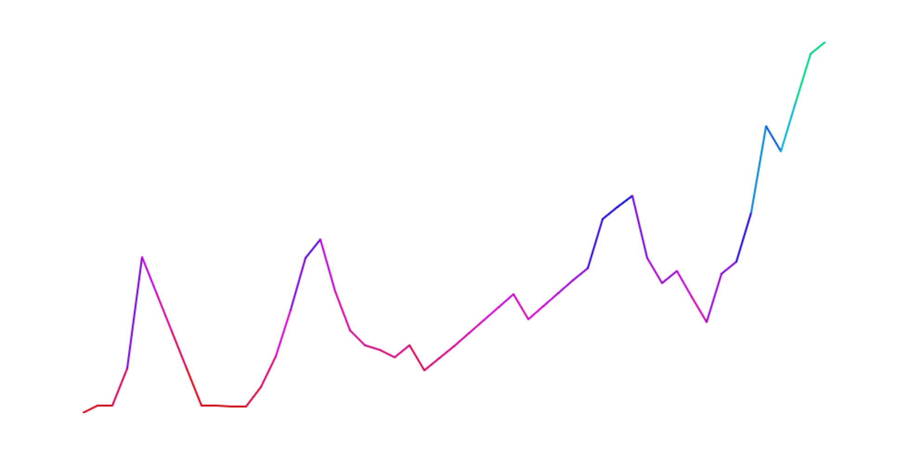
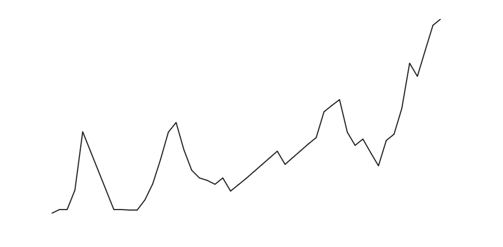

#  Lab Time: Canvas Manipulation (1:15)

| Timing | Type | Topic |
| --- | --- | --- |
| 10 min | [Opening](#opening) |  Introduction to HTML5 Canvas  |
| 20 min | [Lab](#lab1) | Line Graphs and Constructors |
| 30 min | [Code along](#codealong1) | 2D Canvas Drawing |
| 10 min | [Code along](#codealong2) | Performant Animation  |
| 5 min | [Conclusion](#conclusion) | Final Questions & Exit Tickets |
| 65 min | [Lab](#lab2) | Final Project  |


## Objectives

_After this lesson, students will be able to:_

*	Understand the concept of a drawing context on the Canvas element.
*	Understand the role of `requestAnimationFrame` in making performant animations.
* Use JavaScript to generate a data visualization.
* Create asynchronous requests and understand prototypical inheritance.

> Note: This is a lab session where the first portion of class should be spent on revising old material or introducing new JS concepts. An introduction to HTML5 Canvas is provided in this lesson plan as an alternate to reviewing old material. The remaining time should be spent on final projects.

---

<a name = "opening"></a>
## HTML5 Canvas (10 min)

In this lesson we'll develop data visualization using vanilla JavaScript and HTML5 Canvas. HTML5 Canvas Element is a powerful tool that allow us to develop and draw sophisticated data visualizations or even 3D scenes. We can use JavaScript to take advantage of the rich APIs used to draw on the canvas.

>Note: Take a few moments to demo a few interesting uses of the canvas. You can find some cool visualizations on [Threejs](http://threejs.org) or [Codepen](http://codepen.io).

Several methods exist on the `<canvas>` DOMElement that are unique to this element. The `getContext` method establishes whether a 2D or 3D context will be used for drawing. This means that after establishing a context, developers use methods on the context to actually draw on the canvas. In this exercise, we will use methods on the 2D context to draw a line graph from a set of data.



Above is an image of the final visualization. The model for this graph is included in the starter code in the [data.json](starter-code/canvas-2d/models/data.json) file. This JSON file has an Array of numbers that will be used to plot each point on the graph. Before we can even display the graph on the canvas, we must first make an async request for the JSON model.

---

<a name = "lab1"></a>
## Line Graphs and Constructors (20 min)

The goal of this exercise is to extend the functionality of `velocityGraph` in `lineGraph.js` and create a new method called `draw` on the `lineGraph.prototype` that makes a request for the model and returns the data.

Ask the students to open the starter code and look at the velocity.js file. If this is their first time working with native Promises, they may need to look up how to use the API.

When they are done `lineGraph.js` should look like this:

```js
var lineGraph = function (path) {
  this.path = path;
};

lineGraph.prototype = velocityGraph.prototype;

lineGraph.prototype.draw = function(){
  this.fetch().then(function(data){
    console.log(data);
  });
};

```

And `app.js` should look like:

```js
var graph = new lineGraph('/models/data.json');

graph.draw();

console.log(graph);

```

---

<a name = "codealong1"></a>
## 2D Canvas Drawing (30 min)

Help the students figure out the pseudo code for this exercise by outlining what needs to happen.

- Generate a context for drawing
- Figure out height and width of canvas
- Make a request for the data
- Start drawing in lower left corner
- Loop through data points, drawing a line to next point (mapped to Y axis), evenly spacing the data points on the X axis based on the width of the canvas.

To both generate a context for drawing and get the width and height of the canvas, we might as well make a second argument for the `lineGraph` constructor.

lineGraph.js:

```js
var lineGraph = function (canvas, model) {
    this.path = model;
    this.canvas = canvas;
    this.context = canvas.getContext('2d');
```

app.js:

```js
var graph = new lineGraph(document.getElementsByTagName('canvas')[0], '/models/data.json');

```

In the above code, we store the `<canvas>` DOMElement on the lineGraph Object and generate a 2 dimensional context for drawing.

A context is required to draw on the canvas. In the following steps of this code along we will repeatedly use methods on the context (`this.context`) to draw the lines of the graph.

But first, we need to setup the lineGraph with a few more parameters. The first line needs to start drawing on the bottom left of the canvas. To do this we need to get the height of the canvas. The line graph also needs to plot it's points evenly across the entire canvas. For this purpose, we need to store the width.


```js
this.height = parseInt(canvas.getAttribute('height'));
this.width = parseInt(canvas.getAttribute('width'));
this.x = 0;
this.y = this.height;
```

The graph will start at (0, height) on the canvas. Each time there is a new point, we will draw a line from the current point to the next point.

To loop through the Array, use `Array.prototype.forEach` inside the `then` callback in the `draw` method.

```js
data.forEach(function(val){
  console.log(val);
});

```

#### Getting the `y` Value Of Each Point

If we look at the values that are printed, we find that they range from 0-1000. The canvas doesn't have 1000 values in the Y axis, so we have to scale the data to fit the graph. This is a typical problem in data visualization and also why we have provided a `scale` method on the `velocityGraph.prototype`.

To scale the values we can do something this:

```js
this.scale(val, 0, 1000, 0, this.height);
```

The scale method takes 5 arguments in this order: the value to be scaled, the minimum and maximum of the starting range, and the minimum and maximum of new range. In this example, we take the current value from the data and scale it from [0 - 1000] to [0 - canvas height].

To draw the graph from the bottom, subtract the above from the height like so, not forgetting to pass the context of `this` to the forEach function, otherwise `this` will be `window`:

```js
data.forEach(function(val){
  this.y = this.height - this.scale(val, 0, 1000, 0, this.height);
  console.log(this.y);
}.bind(this));

```

#### Getting the `x` Value Of Each Point

Now that we have solved the problem of figuring out each `y` value, lets solve the easier problem of finding each `x` value. We want the points to be evenly spaced, so we can add a parameter called padding to figure out the spacing between each point:

```js
this.padding = this.width / data.length;
```

This simple equation gives us the padding between each point. Divide the width by the length of the data Array.

In the loop:

```js
data.forEach(function(val){
  this.x = this.x += this.padding;
  this.y = this.height - this.scale(val, 0, 1000, 0, this.height);
  console.log(this.x, this.y);
}.bind(this));
```

We haven't actually drawn anything yet, but we have figured out where to plot each point on the canvas. Now let's use the API available on the 2D context we established to draw some lines between the points.

#### Drawing The Line Graph

The steps for drawing each line are as follows:

- Open the path (beginPath)
- Move the context the starting point (moveTo)
- Update `this.x` and `this.y`
- Draw a line to `this.x` and `this.y` (lineTo)
- Close the path (closePath)
- Stroke the path (stroke)

```js
data.forEach(function(val){
  this.context.beginPath();
  this.context.moveTo(this.x, this.y);
  this.x = this.x += this.padding;
  this.y = this.height - this.scale(val, 0, 1000, 0, this.height);
  this.context.lineTo(this.x, this.y);
  this.context.closePath();
  this.context.stroke();
}.bind(this));
```



Now we have a line graph on the canvas, let's style it a bit. The current stroke should be the default color (#000000). What if we wanted to change the color based on the value of the data from red at the bottom to green on top?

Fortunately we can style the stroke with an PI similar to CSS. The problem is typical color systems like hexadecimal and rgba would be cumbersome at best to solve this problem. We would have to create an array of color values and map it to the output of the data. There is another color system called `hsl` that makes this problem easier to solve. As `h` the value changes, a new color (hue) is returned as if we are rotating a color wheel (0-360).

This means we can use the same `scale` method from before to style the `h` value from a value of 156 (green) to 360 (red). If we invert the values red will be at the bottom of the graph and green at the top.   


```js
this.context.strokeStyle = 'hsl('+this.scale(val, 0, 1000, 360, 156)+',100%,40%)';

```


---

<a name = "codealong2"></a>
### Performant Animation (10 min)

Now that we have a colorful graph that visualizes a set of data, let's animate the drawing of that graph using an API available in the browser called `requestAnimationFrame`. This API allows for 60fps animation by allowing developers to tap into the painting engine already looping in the browser.

Every time `requestAnimationFrame` method gets called, we will pass in a callback function that will execute each step of the drawing.

Since we need to deprecate the forEach loop to make this happen, we still need a way to loop through the Array.

Declare a new variable called `this.frame` in the constructor.

```js
this.frame = 0;
```

Remove the forEach loop and replace it with a function called step. Count up 1 frame at the end of the function. For each instance `val` from the existing forEach loop, now reference the position of the data in Array itself (`data[this.frame]`).

```js
this.step = function(){
  this.context.strokeStyle = 'hsl('+this.scale(data[this.frame], 0, 1000, 360, 156)+',100%,40%)';
  this.context.beginPath();
  this.context.moveTo(this.x, this.y);
  this.x = this.x += this.padding;
  this.y = this.height - this.scale(data[this.frame], 0, 1000, 0, this.height);
  this.context.lineTo(this.x, this.y);
  this.context.closePath();
  this.context.stroke();
  this.frame++;
};

```

Now that we've setup the function needed to draw on each frame, call `requestAnimationFrame`, passing in the step function as the callback.

At the end of the `draw` method:

```js
window.requestAnimationFrame(this.step.bind(this));
```

Whenever `step` is called, we must pass the context of `this`, otherwise the context will be `window` inside the function.

To make the drawing engine update, repeat this line at the end of the `step` function.

```js
  this.frame++;
  window.requestAnimationFrame(this.step.bind(this));
};

```

Now that the line graph animates in at 60fps, lets make our code even more performant by only calling `requestAnimationFrame` when there is enough data to draw, rather than the endless loop we have now.

```js
this.step = function() {
  if(this.frame < data.length) {
    //execute code
  }
}
```

`window.requestAnimationFrame` is a performant way to animate with JavaScript. This method is in use in popular animation engines, including jQuery `animate` method. In this code along, we demoed how to use `window.requestAnimationFrame` in the context of drawing a data visualization on the HTML5 Canvas.

---
<a name = "conclusion"></a>
### Conclusion (5 min)

In this demo we've demonstrated how JavaScript can be used to draw a data visualization on the HTML5 Canvas. Several JavaScript libraries are available that make drawing on the canvas easier including `d3`, `chart.js`, `three.js`, and `babylon.js`.

<a name = "lab2"></a>
### Before Next Class
|   |   |
|---|---|
| **UPCOMING PROJECTS**  | [Project 3: Final Project](../../projects/unit4) |
